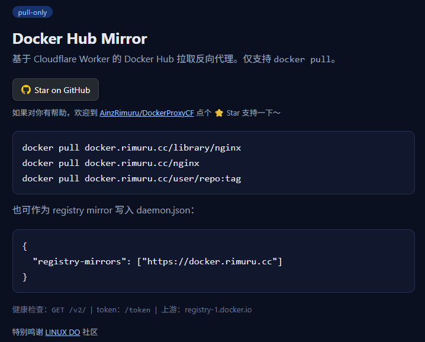
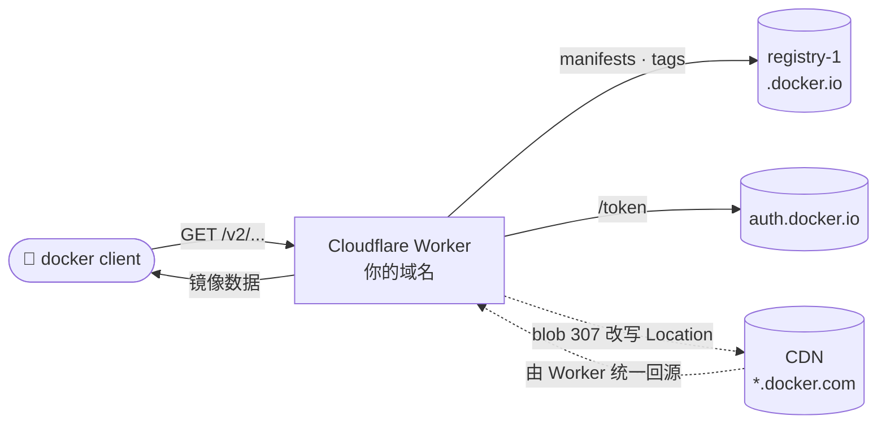

<h1 align="center">🐳 docker-hub-proxy</h1>

<p align="center">
  基于 Cloudflare Worker 的 Docker Hub <strong>pull-only</strong> 反向代理<br/>
  A pull-only Docker Hub reverse proxy on Cloudflare Workers — pull public images through your own domain.
</p>

<p align="center">
  <a href="https://developers.cloudflare.com/workers/"></a>
  <a href="https://developers.cloudflare.com/d1/"></a>
  <a href="https://github.com/AinzRimuru/DockerProxyCF/actions/workflows/deploy.yml"></a>
  <a href="./LICENSE"></a>
  <a href="https://github.com/AinzRimuru/DockerProxyCF"></a>
  <a href="https://github.com/AinzRimuru/DockerProxyCF/commits"></a>
</p>

<p align="center">
  🎮 <strong>在线演示</strong>：<a href="https://docker.rimuru.cc">https://docker.rimuru.cc</a>　·　<code>docker pull docker.rimuru.cc/alpine</code>
</p>

> 仅支持 `docker pull`（GET/HEAD），不支持 push 等写操作。

## 目录 Table of Contents

- [特性 Features](#特性-features)
- [快速开始 Quick Start](#快速开始-quick-start)
- [界面预览 Preview](#界面预览-preview)
- [架构 Architecture](#架构-architecture)
- [部署 Deployment](#部署-deployment)
- [鉴权与限流 Auth and Rate Limiting](#鉴权与限流-auth-and-rate-limiting)
- [配置项速查 Config Reference](#配置项速查-config-reference)
- [FAQ](#faq)
- [限制与说明 Limitations](#限制与说明-limitations)
- [License](#license)

## 特性 Features

- 🐳 **pull-only 透明代理** —— 仅放行 `GET/HEAD/OPTIONS`，push 等写操作返回 `405`。
- 🔁 **blob 回源改写** —— registry 对 blob 的 307 改写回代理统一回源，单一代理域名、无需为 CDN 单独配置。
- 🏷️ **自动补 `library/`** —— `<域名>/nginx` 等价于 `library/nginx`，与官方命名空间一致。
- 🔐 **账号池 + 自动冷却** —— D1 存多账号，按 `last_used` 轮询选号；单号触发 429 自动冷却 6h 并换号。
- 🛡️ **token 保护** —— `/token` 只签发 proxy token（HMAC-SHA256 JWT），真实账号 token 绝不外发；可选 `ACCESS_KEY` 访问控制。
- 🚫 **防泄漏 / 防 SSRF** —— 剥离 `docker-ratelimit-source` 等泄露头，回源仅放行 `*.docker.com` / `*.docker.io`。
- ☁️ **灵活部署** —— Wrangler CLI 或 Cloudflare Pages 单文件；原生支持 `registry-mirror`。

## 快速开始 Quick Start

**直接拉取**（把 `<你的域名>` 换成你自己的域名；也可先用演示站点 `docker.rimuru.cc` 体验）：

```bash
# 官方镜像（library/ 可省略）
docker pull <你的域名>/nginx
docker pull <你的域名>/library/nginx:1.27

# 用户仓库
docker pull <你的域名>/user/repo:tag
```

**作为 registry mirror（推荐，无需改镜像名）：** 编辑 `/etc/docker/daemon.json`（Docker Desktop 在 Settings → Docker Engine）：

```json
{
  "registry-mirrors": ["https://<你的域名>"]
}
```

重启 Docker：

```bash
sudo systemctl restart docker        # Linux
# macOS / Windows：重启 Docker Desktop
```

之后 `docker pull nginx` 会自动走镜像。

## 界面预览 Preview

访问 Worker 根路径 `/` 会返回一个简洁的使用说明页（含拉取示例与 registry-mirror 配置）：



## 架构 Architecture



- **manifests / tags / token**：小文件，由 Worker 直接转发。
- **blob**：registry 返回 307 到 CDN，Worker 把 `Location` 改写成 `/redirect_to_<cdn>/...` 由自己回源，客户端不直连 CDN。
- **鉴权**：把 401 的 `WWW-Authenticate` realm 指回 `/token`，客户端的 token 流程自然走代理。

## 部署 Deployment

### 方式一 Wrangler CLI（推荐）

```bash
npm install
npx wrangler login        # 首次需要登录
npx wrangler deploy
```

部署后得到 `https://docker-hub-proxy.<你的子域>.workers.dev`，也可绑定自定义域名（Workers → Settings → Domains & Routes）。

> 本地调试：`npm run dev`，然后 `curl -i http://127.0.0.1:8787/v2/`。

### 方式二 Cloudflare Pages（单文件）

把 `src/index.js` 重命名为 `_worker.js` 直接上传到 Pages 即可（已是 ES module 默认导出，内容无需改动）。

## 鉴权与限流 Auth and Rate Limiting

匿名拉取受 Docker Hub 限流，且 Cloudflare Worker 出口 IP 全网共享，匿名额度极易被耗尽导致 `429`。本代理支持按需叠加多层鉴权：

| 模式 | 配置 | 拉取额度 | 需 login? | 适用 |
| --- | --- | --- | --- | --- |
| 匿名透传 | 无 | 共享 100/h，易 429 | 否 | 试用 / 低频 |
| 单账号 | `DH_USERNAME` / `DH_PASSWORD` | 账号 200/h，不受共享 IP 影响 | 否 | 个人 |
| 账号池 + 自动冷却 | D1 `accounts` 表 | 多账号轮询，单号 429 自动冷却 6h 换号 | 否 | 团队 / 公开服务 |
| ＋ token 保护 | 叠加 `PROXY_TOKEN_KEY` | 同上 | 否（自动 Bearer） | 公开服务，防 token 被刮取 |
| ＋ 访问控制 | 再叠加 `ACCESS_KEY` | 同上 | 是（`docker login`） | 私有 / 限人 |

> 所有凭据以 **Worker 加密 secret** 存储、不进源码；未配置时自动回退匿名透传。

### 单账号 Single Account

配置一个 Docker Hub 账号后，Worker 会用该账号统一签发 token 并在转发 registry 时覆盖鉴权——所有拉取计入账号额度，客户端无需 `docker login`。

```bash
# 1) 写入账号（格式 用户名:密码，按首个冒号拆分；强烈建议用 Access Token 代替密码）
printf '%s' '你的用户名:你的密码或PAT' > dh_creds

# 2) 导出 Cloudflare 鉴权（脚本优先用环境变量，也可在项目目录放 token 文件，已 gitignore）
export CLOUDFLARE_API_TOKEN='你的CF令牌'

# 3) 写入 Worker secret 并部署
./set-secrets.sh
./deploy.sh
```

完成后 `docker pull <你的域名>/alpine` 直接可用，无需 login。

### token保护 Token Protection

未启用时 `/token` 会把**真实的 Docker Hub 账号 token** 返回给客户端——服务一旦公开，任何人都能从 `/token` 刮走真 token 直连 Docker Hub 消耗账号额度。启用后：

- `/token` 只签发 **proxy token**（HMAC-SHA256 签名的 JWT），**真实账号 token 仅在 Worker 内部使用、绝不外发**。
- registry 要求客户端持有有效 proxy token（标准 Bearer 流程，docker 客户端自动完成 401 → 取 token → 重试）。
- proxy token 对 Docker Hub 无效、签名不可伪造，被刮走也无用。

```bash
# A) 仅 token 保护：任何人可拉取，但拿不到真实账号 token
./set-proxy-key.sh

# B) token 保护 + 访问控制：未知密码者无法拉取
ACCESS_KEY=你的访问密码 ./set-proxy-key.sh
./deploy.sh
```

启用后 `docker pull <你的域名>/alpine` 仍无需手动 login（客户端自动完成鉴权）。若设了 `ACCESS_KEY`，则需先：

```bash
docker login <你的域名> -u任意用户名 -p<ACCESS_KEY>
```

> `PROXY_TOKEN_KEY` 仅 Worker 内部使用、无需记忆；更换它会使已签发 token 失效（proxy token 默认 1 小时过期，影响很小）。

### 账号池与 429 冷却 Account Pool & Cooldown

单账号额度耗尽即 429。绑定 D1 后可存**多个账号**，Worker 按 `last_used` 轮询选号；某账号触发 429 自动**冷却 6 小时**（写 `rate_limited_until=now+6h`），期间跳过、自动换下一个；全部冷却时返回 429。

```bash
# 1) 创建 D1 + 建表（一次性）；把输出的 database_id 填入 wrangler.jsonc 的 d1_databases（binding 名 DB）
./d1-setup.sh

# 2) 录入账号：accounts.txt 每行 用户名:密码（# 为注释；密码建议用 Access Token）
./insert-accounts.sh
```

**accounts 表字段：** `username`、`password`、`enabled`(0/1)、`rate_limited_until`(ms 时间戳，0=可用)、`last_used`、`limited_count`(被 429 次数)。

> D1 有账号则用账号池；D1 为空或查询失败时自动回退单账号。可隔离验证冷却逻辑：`./verify-cooldown.sh`。

## 配置项速查 Config Reference

| 变量 / 绑定 | 类型 | 作用 | 必填 | 设置方式 |
| --- | --- | --- | --- | --- |
| `DH_USERNAME` / `DH_PASSWORD` | Worker Secret | 单账号回退鉴权 | 否 | `./set-secrets.sh` |
| `DB` | D1 Binding | 账号池存储（多账号 + 冷却） | 否 | `wrangler.jsonc` + `./d1-setup.sh` |
| `PROXY_TOKEN_KEY` | Worker Secret | token 保护签名密钥（HMAC-SHA256） | 否（公开服务建议） | `./set-proxy-key.sh` |
| `ACCESS_KEY` | Worker Secret | 访问控制密码（启用后需 `docker login`） | 否 | `ACCESS_KEY=xxx ./set-proxy-key.sh` |
| `CLOUDFLARE_API_TOKEN` | 本地环境变量 | 脚本部署 / 写 secret 用 | 仅脚本部署时 | `export` 或项目目录 `token` 文件 |

## FAQ

**Q：拉取报 `429 TOOMANYREQUESTS`？**
匿名额度被 Worker 共享出口 IP 耗尽。配置账号鉴权（单账号或账号池）即走账号额度（200/h），不受共享 IP 影响。

**Q：客户端需要 `docker login` 吗？**
默认不需要。仅当设置了 `ACCESS_KEY`（访问控制）时才需 `docker login <域名> -u任意用户名 -p<ACCESS_KEY>`。

**Q：如何绑定自定义域名？**
Cloudflare Dashboard → Workers & Pages → 你的 Worker → Settings → Domains & Routes 添加自定义域名（域名需托管在 Cloudflare）。

**Q：registry-mirror 和直接 pull 有什么区别？**
- 直接 pull：镜像名前要带域名，如 `docker pull <域名>/nginx`。
- registry mirror：写入 `daemon.json` 后 `docker pull nginx` 自动走代理，无需改镜像名（推荐）。

**Q：凭据安全吗？**
账号以 Worker 加密 secret 存储、不进源码；启用 token 保护后真实 token 绝不外发；响应会剥离 `docker-ratelimit-source` 等泄露头；回源仅放行 `*.docker.com` / `*.docker.io` 防 SSRF。

**Q：能代理其它 registry（gcr / quay / ghcr）吗？**
不能。上游固定 `registry-1.docker.io`，仅代理 Docker Hub。

## 限制与说明 Limitations

- **仅 pull**：所有写操作（push / delete 等）返回 `405`。
- **仅代理 Docker Hub**：上游固定 `registry-1.docker.io`。
- **子请求数**：blob 回源经 Worker 转发，manifest / token 走 Worker；Worker Free 计划每次请求 50 个子请求上限，对单次 pull 足够。
- **额度共享**：账号池 / 单账号额度被所有使用者共享，建议用专用 Access Token 并在泄露后及时轮换。

## License

本项目基于 [MIT License](./LICENSE) 开源。

## Star History

<a href="https://www.star-history.com/?repos=AinzRimuru/DockerProxyCF&type=date">
 <picture>
   <source media="(prefers-color-scheme: dark)" srcset="https://api.star-history.com/chart?repos=AinzRimuru/DockerProxyCF&type=date&theme=dark">
   <source media="(prefers-color-scheme: light)" srcset="https://api.star-history.com/chart?repos=AinzRimuru/DockerProxyCF&type=date">
   
 </picture>
</a>

## 鸣谢 Acknowledgements

[LINUX DO - 新的理想型社区](https://linux.do)
